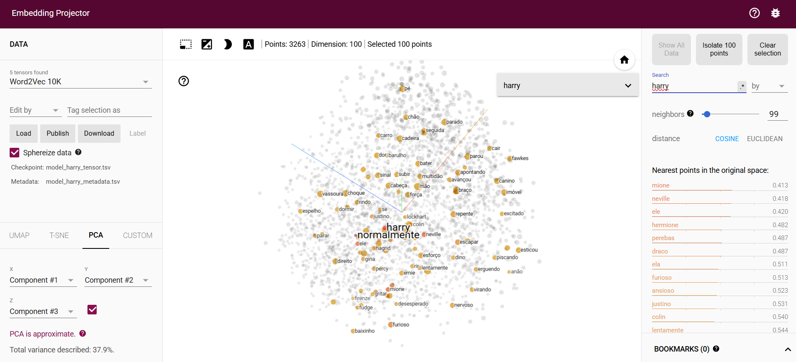
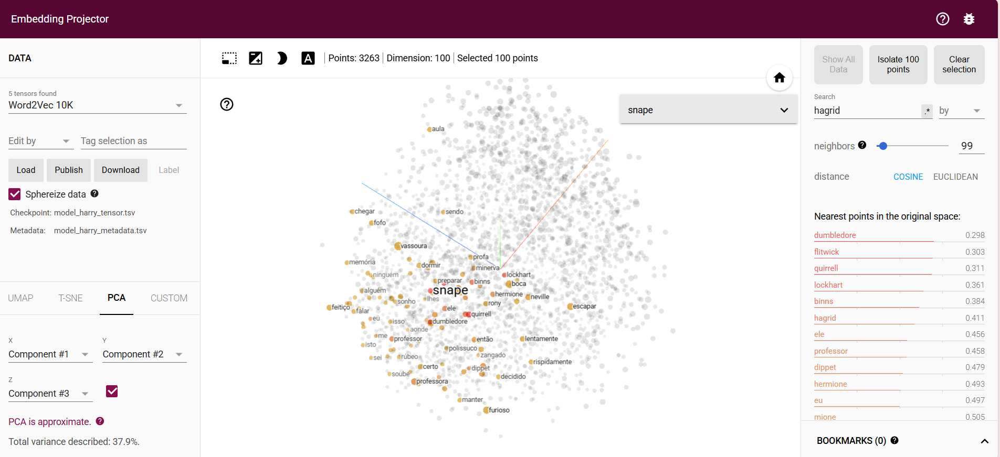
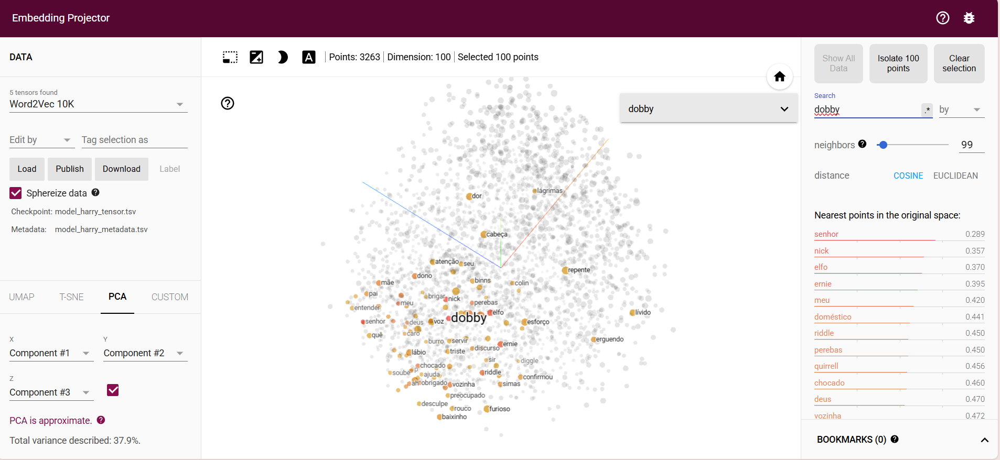
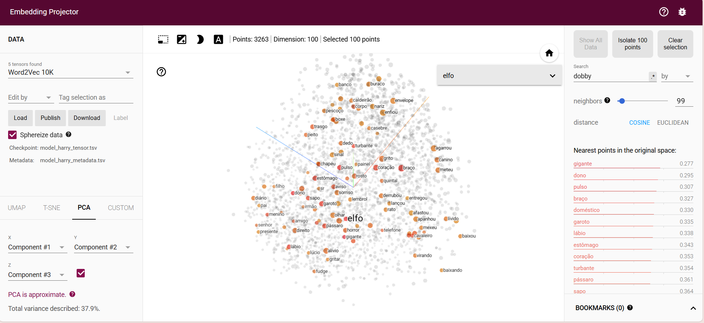

# Análise de Texto com Word2Vec - Casos Harry Potter

Este projeto demonstra como é possivel utilizar a biblioteca **Gensim** para treinar modelos de **Word2Vec** com textos reais, utilizando como base dois livros da saga *Harry Potter*.

## Objetivos

- Compreender o funcionamento do algoritmo Word2Vec
- Treinar modelos com frases de exemplo e com textos reais
- Explorar representações semânticas de palavras
- Realizar operações vetoriais para descobrir relações semânticas

## Etapas Realizadas

### 1. Treino Inicial com Frases Simples
Foi utilizado um conjunto de frases exemplo (listas de palavras) para treinar um modelo Word2Vec inicial.
### 2. Consulta de Vetores
O modelo treinado foi usado para aceder à representação vetorial de palavras, como "sentence", demonstrando como estas são codificadas.

### 3. Gravação e Carregamento do Modelo
Foi demonstrado como guardar o modelo treinado num ficheiro `.model` e recarregá-lo posteriormente, permitindo reutilização sem novo treino.

### 4. Processamento de Textos Reais
Dois livros da coleção Harry Potter foram lidos de ficheiros `.txt`. Os textos foram segmentados em frases e tokenizados, criando uma estrutura compatível com o Gensim: lista de listas de palavras.

**Arquivos utilizados:**

- `Harry_Potter_e_A_Pedra_Filosofal.txt`
- `Harry_Potter_Camara_Secreta-br.txt`

### 5. Treino com Dados Literários
Com as frases dos livros, treinou-se um novo modelo Word2Vec com:

- Vetores de tamanho 100 (`vector_size=100`)
- 20 epochs de treino (`epochs=20`)

Este modelo permitiu a representação do vocabulário presente nos livros num espaço vetorial, refletindo semelhanças semânticas baseadas no contexto de uso.

### 6. Exploração Semântica
Foram realizadas diversas consultas ao modelo para:

- Encontrar palavras semelhantes (ex: similares a "harry")
- Explorar operações vetoriais: `harry + snape - grifinória`
- Avaliar semelhanças entre pares de palavras

## Visualização com TensorFlow Embedding Projector

Para explorar visualmente os vetores de palavras gerados pelo modelo Word2Vec, utilizei a ferramenta [TensorFlow Embedding Projector](https://projector.tensorflow.org/).

### O que foi feito:

1. Exportação dos vetores do modelo treinado para um ficheiro `.tsv`, contendo os embeddings.
2. Criação de um ficheiro `.tsv` com labels (palavras correspondentes a cada vetor).
3. Upload dos dois ficheiros no site do Embedding Projector.
4. Exploração visual das relações entre palavras, clusters e proximidades semânticas com ferramentas como PCA e t-SNE.

### Capturas de ecrã:

## Conclusão

Este notebook exemplifica de forma prática como aplicar Word2Vec em textos reais. Os resultados demonstraram a capacidade do modelo de capturar relações semânticas complexas com base no uso das palavras em contexto.
